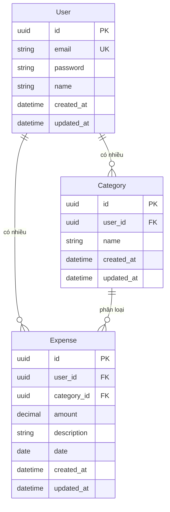

# Database Schema - ERD

## Mô hình ERD

## Mô tả các bảng

### User
- **id**: UUID, Primary Key
- **email**: String, Unique, Not Null - Email đăng nhập
- **password**: String, Not Null - Mật khẩu đã hash bằng bcrypt
- **name**: String, Not Null - Tên người dùng
- **created_at**: Timestamp - Thời gian tạo
- **updated_at**: Timestamp - Thời gian cập nhật

### Category
- **id**: UUID, Primary Key
- **user_id**: UUID, Foreign Key -> User.id - Người dùng sở hữu category
- **name**: String, Not Null - Tên danh mục
- **created_at**: Timestamp - Thời gian tạo
- **updated_at**: Timestamp - Thời gian cập nhật

**Index**: (user_id, name) - Unique constraint để mỗi user không có category trùng tên

### Expense
- **id**: UUID, Primary Key
- **user_id**: UUID, Foreign Key -> User.id - Người dùng sở hữu chi tiêu
- **category_id**: UUID, Foreign Key -> Category.id - Danh mục chi tiêu
- **amount**: Decimal(15,2), Not Null - Số tiền chi
- **description**: String, Nullable - Mô tả chi tiêu
- **date**: Date, Not Null - Ngày chi tiêu
- **created_at**: Timestamp - Thời gian tạo
- **updated_at**: Timestamp - Thời gian cập nhật

**Indexes**:
- (user_id, date) - Để query nhanh theo user và ngày
- (user_id, category_id) - Để query nhanh theo user và category

## Ràng buộc

1. **Foreign Key Constraints**:
   - Expense.user_id -> User.id (ON DELETE CASCADE)
   - Expense.category_id -> Category.id (ON DELETE RESTRICT - không cho xóa category nếu còn expense)
   - Category.user_id -> User.id (ON DELETE CASCADE)

2. **Unique Constraints**:
   - User.email (unique)
   - Category(user_id, name) (unique)

3. **Check Constraints**:
   - Expense.amount > 0

